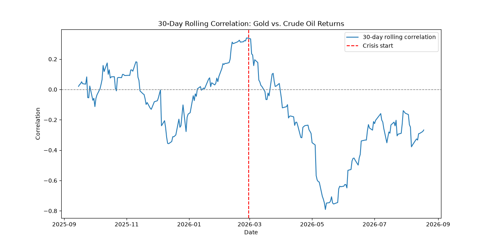
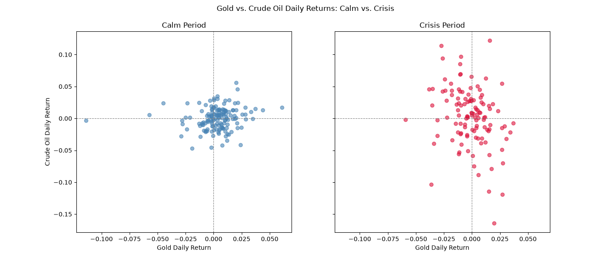
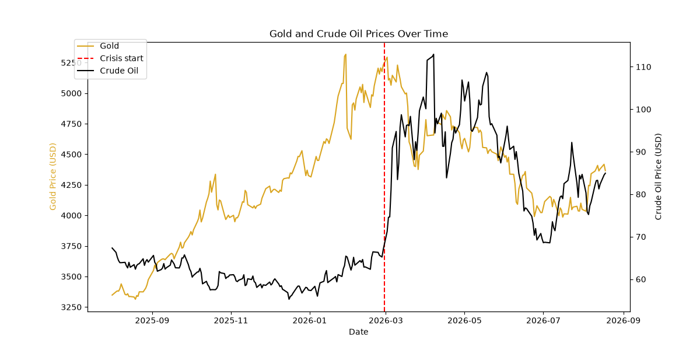

# Did the Strait of Hormuz Crisis Change the Gold-Oil Relationship?


## Overview

This project examines whether the relationship between gold and crude oil prices changed following the onset of the 2026 Strait of Hormuz crisis. Using daily futures price data, I computed the correlation between gold and crude oil daily returns during a "calm" period before the crisis and compared it to the correlation during the crisis period itself. The analysis found that the correlation was weak in both periods, but shifted from mildly positive (0.137) before the crisis to mildly negative (-0.278) during it.

## Question and Hypothesis

**Question:** Did the correlation between gold and crude oil daily returns change following the Strait of Hormuz crisis (February 28, 2026)?

**Hypothesis:** Going into the analysis, I expected correlation to turn *negative* during the crisis. I believed gold would fall because of spiked inflation expectations, and that crude prices would surge because a major amount of crude trade would stop. Under this reasoning, oil rising on a supply shock and gold facing rate-driven headwinds at the same time would pull the two assets in opposite directions, producing a negative correlation. The data was broadly consistent with this: correlation shifted from mildly positive before the crisis to mildly negative (-0.278) during it.


## Data Source and Instrument Choice

- **Gold:** `GC=F` (COMEX gold futures, continuous front-month contract)
- **Crude oil:** `CL=F` (NYMEX WTI crude oil futures, continuous front-month contract)
- **Source:** Yahoo Finance, retrieved via the `yfinance` Python library
- **Date range:** August 2025 – August 2026, split into a ~6-month calm period and a ~6-month crisis period (length-matched for a fair comparison — see *Method* below)


## Method

1. Pulled daily closing prices for both instruments and merged them on their shared trading dates (inner join, so only days with data for both assets were kept).
2. Computed daily percentage returns for each asset (`.pct_change()`), rather than correlating raw price levels. Raw prices trend together over time due to broad market drift, which would produce a misleadingly high correlation unrelated to real day-to-day co-movement.
3. Labeled each day as `calm` (before Feb 28, 2026) or `crisis` (on/after), and computed the return correlation separately for each period.
4. **Sample-size correction:** the initial calm period (using the full available history) spanned roughly 2 years versus the crisis period's ~6 months — an unfair comparison, since correlation estimates from smaller samples are noisier. I re-ran the calm-period calculation using only the 6 months immediately preceding the crisis, for a length-matched comparison.
5. Computed a 30-day rolling correlation across the full timeline to visualize how the relationship evolved continuously, rather than relying on two static snapshots.

## Key Findings

**Calm period correlation:** 0.137 (weak positive)
**Crisis period correlation:** -0.278 (weak-to-moderate negative)



The rolling correlation chart shows that the relationship was already unstable *before* the crisis, oscillating between positive and negative. This is consistent with a static correlation this weak, since a low average often reflects a relationship that swings back and forth rather than one that's mildly positive throughout. Following the crisis onset, the rolling correlation shows a more sustained lean toward negative territory.



The side-by-side scatter plots visually confirm the weak correlation in both periods. Neither cloud of points shows a clear diagonal trend, consistent with the low correlation coefficients. Notably, the crisis-period scatter shows a wider vertical spread (larger swings in oil returns) than the calm period, suggesting **crude oil became more volatile during the crisis independent of its correlation with gold**.



This chart shows the underlying price levels for both assets over the full timeline, with the crisis start date marked. It provides context for the return-based analysis above, showing what was actually happening to each asset's price while the correlation between them was shifting.

**Interpretation:** A plausible explanation is that gold and oil are normally linked loosely through shared macroeconomic drivers (e.g. dollar strength, general risk sentiment), a confounding variable rather than a direct causal relationship. During the crisis, oil was driven by a direct supply shock specific to itself, while gold likely saw increased safe-haven demand. Two different mechanisms that may have pulled the assets' daily moves out of sync rather than together.

## Limitations

- **Correlation is not causation.** Any relationship observed here is consistent with both assets responding to a shared confounding variable (e.g. broad risk sentiment), not one directly influencing the other.
- **Small, ongoing sample.** The crisis period covers only ~6 months of an event still unfolding at the time of writing; conclusions may not generalize to how the relationship settles over a longer horizon.
- **Rolling correlation noise.** A 30-day rolling window is inherently sensitive to short-term fluctuations; wider windows would likely produce a smoother, less erratic line.
- **Futures roll effects.** Continuous front-month futures contracts can show small price discontinuities at contract rollover dates, which is not corrected for here.
- **Single historical episode.** This analysis reflects one specific crisis; the same relationship might behave differently in a different geopolitical or macroeconomic context.

## How to Run

```bash
pip install -r requirements.txt
python correlation_analysis.py
```

**Requirements:** `pandas`, `numpy`, `matplotlib`, `yfinance`

